  
  
  
  
  

  <a href="https://www.jacob-decoded.de">
    <picture>
      <source media="(max-width: 600px)" srcset="https://raw.githubusercontent.com/JacobMenge/JacobMenge/main/assets/profil-handy.svg" />
      
    </picture>
  </a>

